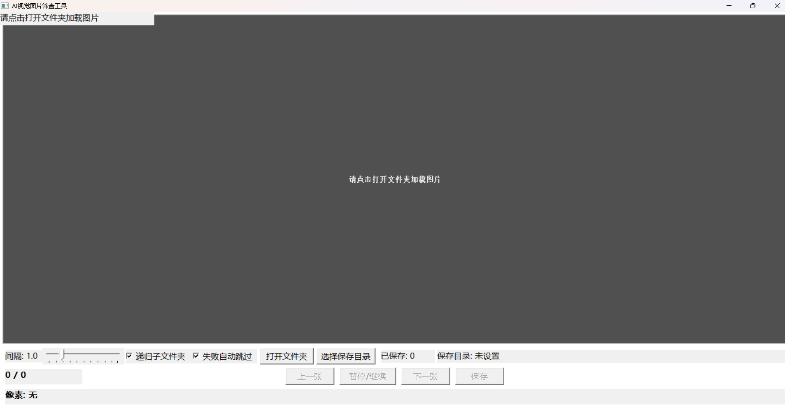

# ImgScreener(手动筛选过漏杀)

> **AI工业检中要手动筛选过漏杀，开发此软件以微微解放双手。后续根据实际使用还会更新添加功能，持续更新中......**

---

为什么用如此臃肿的python来开发呢，现阶段来看python的库更多，完成效率更高，后续加功能更容易，更加节省我的开发时间。

因此本项目包含两个版本：

- **Python版**：开发快、加功能容易，对应 `main.exe`
- **C++原生版**：启动快、运行流畅、可单文件发布，对应 `ImageScreener.exe`

两个版本操作方式基本一致，学会一个就能用另一个。

---

## 界面




---

## 使用方法

### Python版（main.exe）

1. 双击 `main.exe` 运行
2. 点击「打开文件夹」加载图片。
3. 按 **`回车`** 暂停/继续播放，自动轮播显示文件夹内图片（速度可调）。
4. 按 **空格键** 一键保存图片到 `自定义` 目录，并暂停。
5. 支持键盘操控：**`←/→`** 浏览，**`↑/↓`** 调速。

### C++原生版（ImageScreener.exe）

1. 双击 `ImageScreener.exe` 运行。
2. 点击「打开文件夹」加载图片。
3. 按 **`回车`** 暂停/继续播放，自动轮播显示文件夹内图片（速度可调）。
4. 按 **空格键** 一键保存图片到 `自定义` 目录，并暂停。
5. 支持键盘操控：**`←/→`** 浏览，**`↑/↓`** 调速。
6. 额外支持：鼠标悬停查看原图像素（RGBA / Gray / HEX）、显示坐标和原图坐标。

---

## 快捷键

| 按键 | 功能 |
|---|---|
| `←` | 上一张 |
| `→` | 下一张 |
| `回车` | 暂停 / 继续 |
| `空格` | 保存当前图片 |
| `↑` | 加快播放速度 |
| `↓` | 减慢播放速度 |

---

## 功能对比

| 功能 | Python版 | C++原生版 |
|---|---|---|
| 自动轮播图片 | ✅ | ✅ |
| 回车暂停/继续 | ✅ | ✅ |
| 空格保存并暂停 | ✅ | ✅ |
| ←/→ 浏览 | ✅ | ✅ |
| ↑/↓ 调速 | ✅ | ✅ |
| 递归扫描子文件夹 | ❌ | ✅ |
| 下一张预加载 | ❌ | ✅ |
| 原图像素查询 | ❌ | ✅ |
| RGBA / Gray / HEX | ❌ | ✅ |
| 显示坐标 + 原图坐标 | ❌ | ✅ |
| Pixel ToolTip | ❌ | ✅ |
| 解码失败自动跳过 | ❌ | ✅ |
| 连续失败自动暂停 | ❌ | ✅ |
| saved_list 恢复 | ❌ | ✅ |
| 保存相对路径 | ❌ | ✅ |
| 静态单exe | ⚠️ 需打包 | ✅ |
| 无Python依赖 | ❌ | ✅ |
| 开发速度 | 快 | 慢 |
| 运行速度 | 一般 | 快 |
| 加功能难度 | 低 | 高 |

---

## 下载

### Python版

直接下载：

```text
main.exe
```

### C++原生版

在仓库的 `C++` 文件夹内，直接下载：

```text
ImageScreener.exe
```

源码为 `C++/ImageScreener.cpp`。

> 只要使用，直接下载对应 exe 即可。  
> C++版如果使用静态链接 `/MT` 编译，单个 exe 可直接运行，无需安装 Python 或 VS 运行库。

---

## 从源码编译

### Python版

1. 安装依赖：

```bash
pip install pillow
```

2. 运行：

```bash
python main.py
```

3. 打包：

```bash
pyinstaller -F -w main.py
```

### C++原生版（VS2017 / Win32 / WIC）

源码文件位于 `C++/ImageScreener.cpp`。

1. 用 Visual Studio 2017 打开项目。
2. 右键项目 → 属性 → 配置属性 → 常规 → **目标名称**，改成你想要的名字，例如 `ImageScreener`。
3. 右键项目 → 属性 → C/C++ → 代码生成 → **运行库**：
   - Release 选 **多线程 (/MT)**
   - Debug 选 **多线程调试 (/MTd)**
4. 点击 **重新生成解决方案**。
5. 生成目录一般在：

```text
x64\Release\ImageScreener.exe
```

> 改成 `/MT` 后，exe 会变大一些，但可以脱离 VS 运行库独立运行。

---

## 保存目录说明

- 默认保存目录：图片源目录下的 `saved` 文件夹
- 也可以手动点击「选择保存目录」指定其他文件夹
- 保存目录会自动排除，不会再次扫描到已保存的图片
- 已保存记录写入 `saved_list.txt`
- Python版使用 UTF-8 编码追加写入
- C++版使用 UTF-8 BOM，并优先从 `saved_list.txt` 恢复

---

## 说明

本项目主要用于 AI 工业检测中的手动过漏杀筛选，减少重复劳动。  
后续会根据实际使用继续更新，欢迎提 Issue 或建议。
