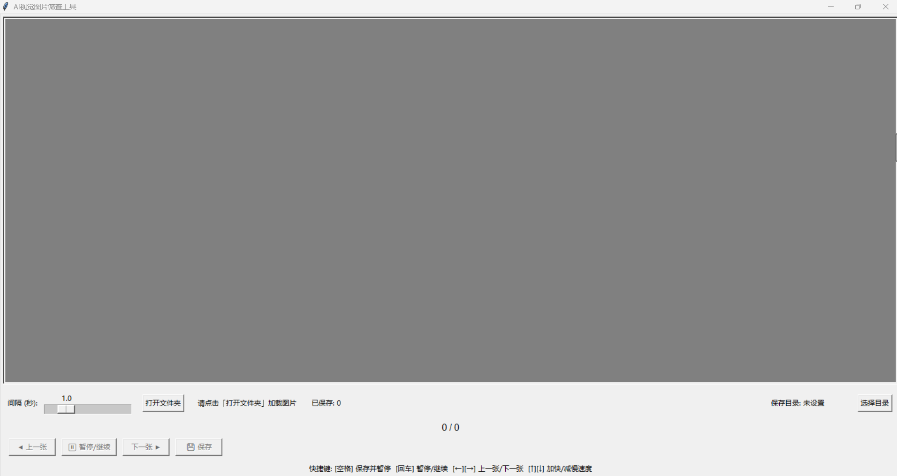

# ImgScreener

> **AI工业检中要手动筛选过漏杀，开发此软件以微微解放双手。后续根据实际使用还会更新添加功能，持续更新中......**
> 为什么用如此臃肿的python来开发呢，现阶段来看python的库更多，完成效率更高，后续加功能更容易。

---

## 界面

## 使用方法
1. 双击 `main.exe` 运行
2. 点击「打开文件夹」加载图片。
3. 按 **`回车`** 暂停/继续播放，自动轮播显示文件夹内图片（速度可调）。
4. 按 **空格键** 一键保存图片到 `自定义` 目录,并暂停。
5. 支持键盘操控：**`←/→` 浏览，`↑/↓` 调速**。

## 只要使用直接下载main.exe
